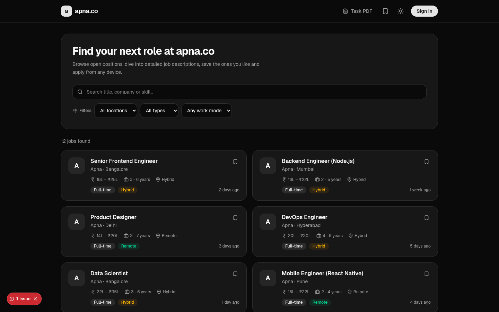
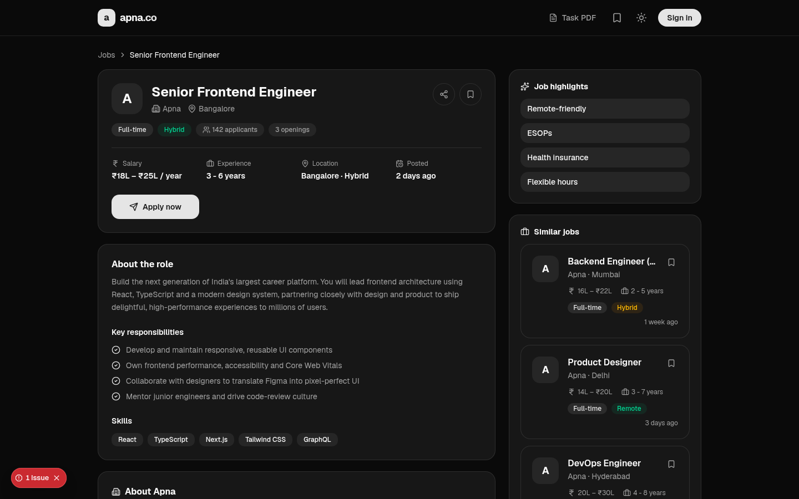
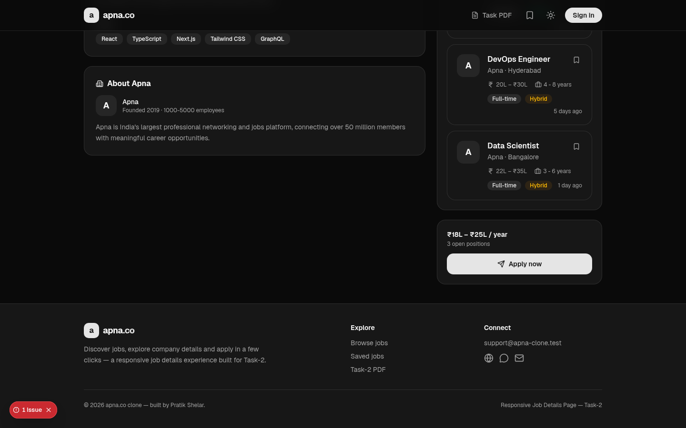
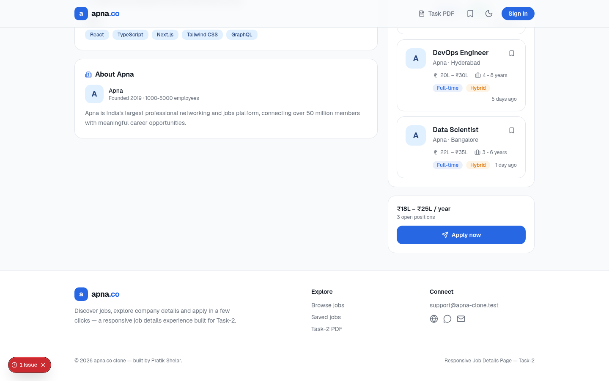
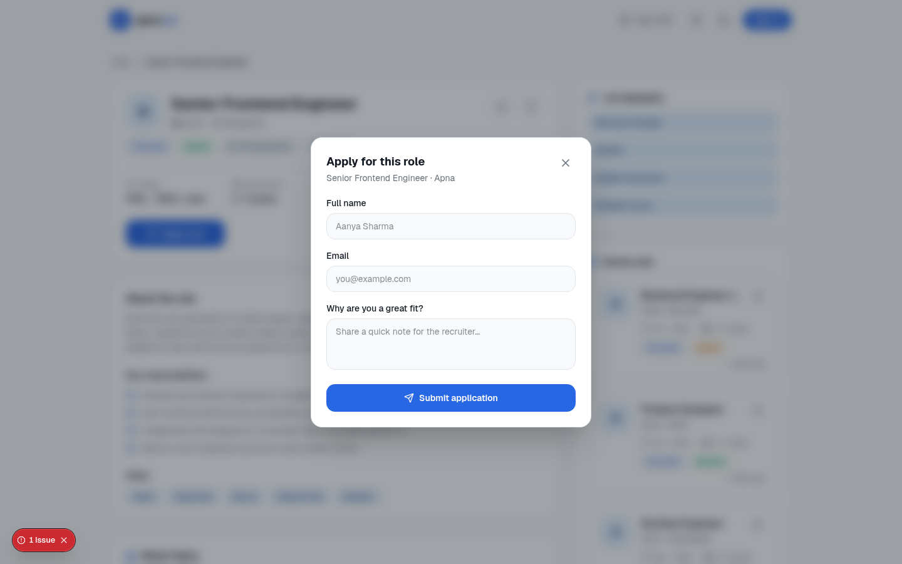
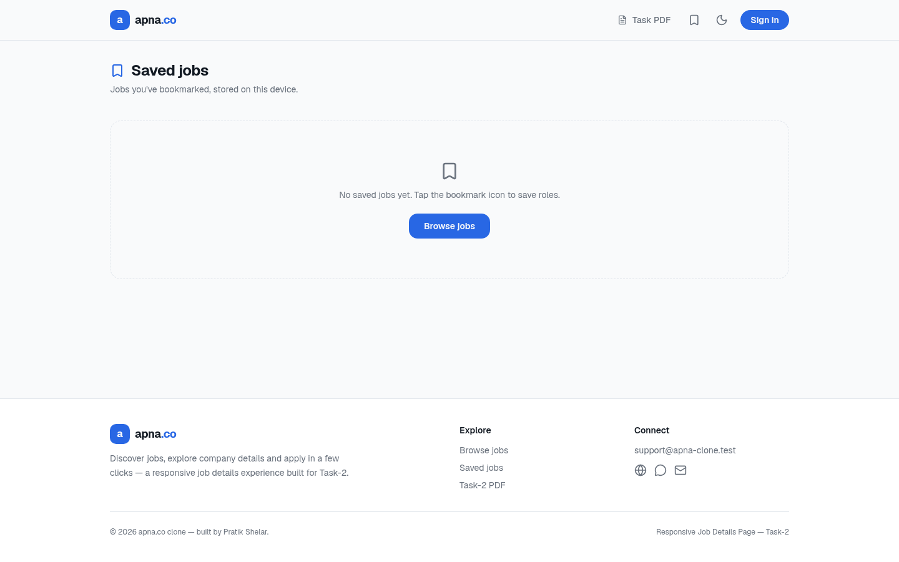
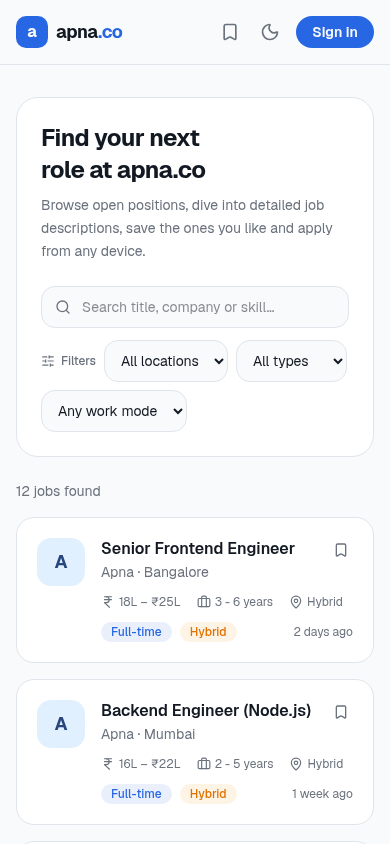
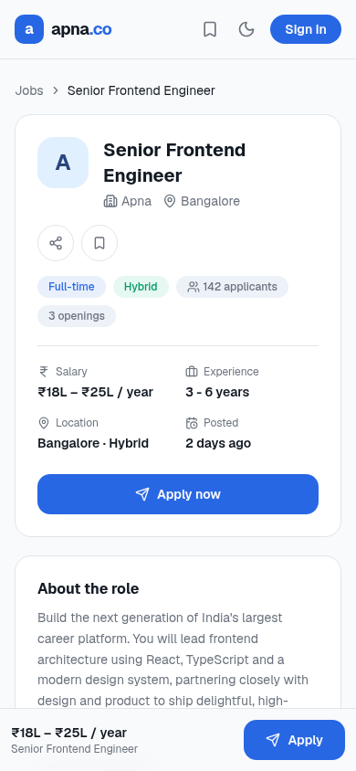

<div align="center">


# apna.co — Job Details Clone

**A pixel-perfect, fully responsive Job Portal** modeled on [apna.co](https://apna.co).  
Job listings, rich job details, bookmarks, apply flow, dark/light theme — built with **Next.js 16 & TypeScript**.

**Developed by [Pratik Shelar](https://github.com/Pratik-Ghrcemp)**



</div>

---

## Live Screenshots

### Job Listings — Home Page


---

### Job Detail Page — Top Section



---

### Job Detail Page — Description, Skills & Company



---

### Dark Mode



---

### Apply Now Modal



---

### Saved Jobs (Bookmarks)



---

### Mobile — Listings



---

### Mobile — Job Detail



---

## Features

- **Job Listings** (`/`) — keyword search with location, job-type, and work-mode filters; client-side pagination
- **Job Detail Page** (`/job/[id]`) — the centerpiece of the project:
  - Header card: role, company logo, salary, experience, applicant count, openings
  - Full description, key responsibilities, required skills
  - Company "About" section with founding info and headcount
  - Job highlights (ESOPs, remote-friendly, health insurance, etc.)
  - Similar jobs sidebar / section
  - Sticky **Apply** card on desktop; sticky **Apply** bar on mobile
- **Apply Flow** — modal form (bottom sheet on mobile) with field validation and toast confirmation
- **Bookmarks** (`/bookmarks`) — save and revisit roles; persisted via `localStorage`
- **Share** — copies the job URL to clipboard with a one-click toast
- **Dark / Light Theme** — system-aware default with one-click toggle via `next-themes`
- **Responsive & Accessible** — semantic HTML, ARIA labels, keyboard navigation throughout
- **Loading Skeletons** for perceived performance
- **Custom 404 page** for unknown routes

---

## Tech Stack

| Layer | Technology |
|---|---|
| Framework | Next.js 16 (App Router) |
| Language | TypeScript |
| Styling | Tailwind CSS v4 |
| Components | shadcn/ui + Radix UI |
| Icons | lucide-react |
| Theming | next-themes |
| Data | Typed static mock JSON (`lib/jobs.ts`) |
| Deployment | Vercel |

---

## Project Structure

```
apna-co-job-clone/
├── app/
│   ├── layout.tsx              # Root layout — providers, header, footer, metadata
│   ├── page.tsx                # Home — job listings with search & filters
│   ├── globals.css             # Design tokens & Tailwind v4 theme
│   ├── not-found.tsx           # Custom 404 page
│   ├── job/
│   │   └── [id]/
│   │       └── page.tsx        # Dynamic job detail route
│   └── bookmarks/
│       └── page.tsx            # Saved jobs page
│
├── components/
│   ├── site-header.tsx         # Top navigation bar with theme toggle
│   ├── site-footer.tsx         # Footer with author credit — Pratik Shelar
│   ├── theme-toggle.tsx        # Dark / light switch button
│   ├── providers.tsx           # ThemeProvider + BookmarksContext
│   ├── job-card.tsx            # Reusable job listing card
│   ├── job-card-skeleton.tsx   # Loading skeleton for job cards
│   ├── job-detail.tsx          # Full interactive job detail view (client)
│   ├── apply-dialog.tsx        # Apply modal / bottom sheet form
│   └── ui/
│       └── button.tsx          # shadcn/ui Button primitive
│
├── lib/
│   ├── jobs.ts                 # Mock data + typed query helpers
│   └── utils.ts                # Tailwind cn() merge utility
│
└── public/
    ├── screenshots/            # App screenshots used in README & docs
    └── Task-2.pdf              # Original assignment brief
```

---

## Routing

| Route | Page |
|---|---|
| `/` | Job listings with search and filters |
| `/job/[id]` | Full detail view for a single job |
| `/bookmarks` | User-saved jobs |
| `*` | Custom 404 not-found page |

---

## Data Model

All jobs are defined as a typed static array in `lib/jobs.ts`:

```ts
type Job = {
  id: string
  title: string
  company: string
  logo: string
  location: string
  salary: string
  experience: string
  jobType: "Full-time" | "Part-time" | "Contract" | "Internship"
  workMode: "On-site" | "Remote" | "Hybrid"
  postedAt: string
  applicants: number
  openings: number
  tags: string[]
  description: string
  responsibilities: string[]
  skills: string[]
  highlights: string[]
  about: string
  founded: string
  employees: string
}
```

Helper functions `getAllJobs`, `getJobById`, and `getSimilarJobs` keep the UI decoupled from the data source — swapping to a real API only requires changes inside `lib/jobs.ts`.

---

## Getting Started

### Prerequisites

- Node.js 20+
- pnpm (recommended) or npm / yarn

### Run Locally

```bash
# 1. Clone the repository
git clone https://github.com/Pratik-Ghrcemp/apna-co-job-clone.git
cd apna-co-job-clone

# 2. Install dependencies
pnpm install

# 3. Start the development server
pnpm dev
```

Open [http://localhost:3000](http://localhost:3000) in your browser.

### Available Scripts

| Command | Description |
|---|---|
| `pnpm dev` | Start the local development server |
| `pnpm build` | Create an optimised production build |
| `pnpm start` | Serve the production build locally |
| `pnpm lint` | Run ESLint across the codebase |

---

## Deployment

The project is connected to **Vercel**. Every push to `main` automatically triggers a production deployment.

To deploy your own fork:

1. Push the repo to GitHub.
2. Go to [vercel.com/new](https://vercel.com/new) and import the repo.
3. Select **Next.js** as the framework (auto-detected).
4. No environment variables are required.
5. Click **Deploy**.

---

## Author

**Pratik Shelar**

- GitHub: [@Pratik-Ghrcemp](https://github.com/Pratik-Ghrcemp)

---

## License

This project was created for educational and assessment purposes (Task-2).  
The Apna.co brand and its design belong to their respective owners.
